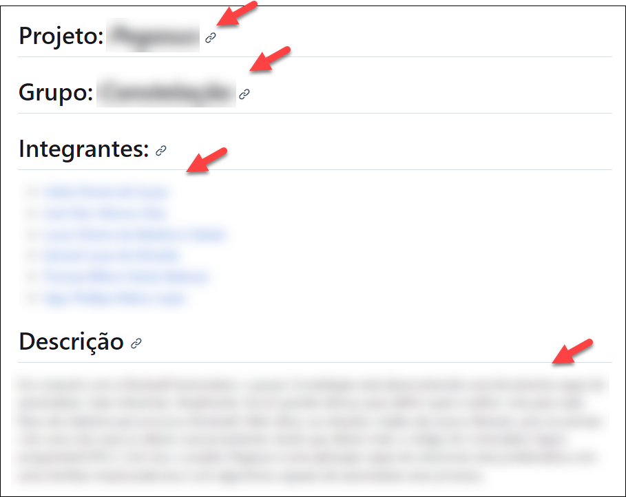
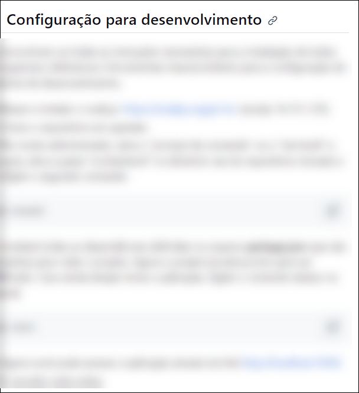
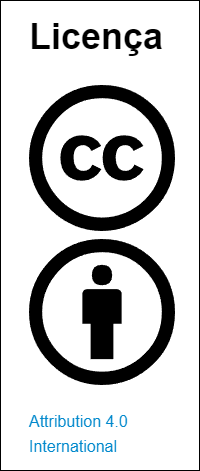
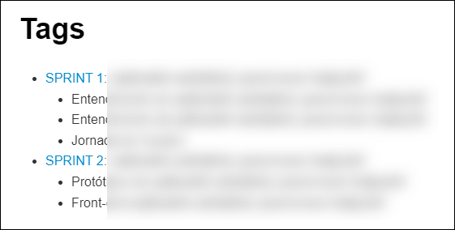
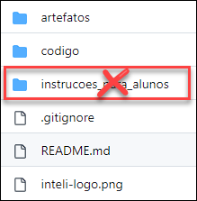

# Check-list para Entrega do Projeto

**Nome do Projeto:** Tapete sensorial como recurso lúdico para assistência a crianças com Transtorno do Espectro Autista.

# Introdução

Este é um dos repositórios do projeto de alunos do Inteli em parceria com o Departamento de Fisioterapia, Fonoaudiologia e Terapia Ocupacional (FOFITO) da Faculdade de Medicina da Universidade de São Paulo (FMUSP). Este projeto foi desenvolvido no 1º semestre de 2024 por alunos do Módulo 8 do curso de Ciência da Computação.

# 1. No arquivo README.md
 (a) Os logos do parceiro e do Inteli estão no topo da página.
 
<table>
<tr>
<td>

</td>
<td>
</td>
</tr>
</table>

(b) O texto abaixo com as instruções iniciais para os alunos deve ser removido.

> Se você é um dos alunos que faz parte deste grupo, veja as [instruções para os alunos](./instrucoes_para_alunos/LEIAME_aluno.md).

(c) Os campos projeto, grupo e integrantes estão preenchidos corretamente.

(d) O campo descrição contém um resumo do problema e da solução desenvolvida.

<td>

(e) Contém instruções para desenvolvedores utilizarem o código do repositório.

<td>

(f) Menciona explicitamente que a licença do projeto é a "Attribution 4.0 International".

(g) O nome da licença está com link para https://creativecommons.org/licenses/by/4.0/?ref=chooser-v1

(h) Apresenta o logo https://creativecommons.org/wp-content/themes/vocabulary-theme/vocabulary/svg/cc/icons/cc-icons.svg#cc-logo

(i) Apresenta o logo https://creativecommons.org/wp-content/themes/vocabulary-theme/vocabulary/svg/cc/icons/cc-icons.svg#cc-by

<td>

(j) Há uma lista das tags de cada sprint, com a enumeração dos artefatos de cada tag.

<td>

# 2. Organização das pastas e arquivos

(a) A raiz do repositório contém apenas as pastas para artefatos e codigo e os arquivos README.md, .gitignore e inteli-logo.png (a pasta instrucoes_para_alunos deve ser removida).

<td>

# 3. Na pasta /artefatos

(a) Há apenas arquivos no formato markdown (.md) e a pasta de imagens (img).

(b) Todos os links dentro dos arquivos no formato markdown (.md) estão funcionando.

(c) Todas as imagens estão aparecendo corretamente dentro dos arquivos no formato markdown (.md).

# 4. Na pasta /src

(a) Há duas pastas, onde cada uma corresponde a um item de software do projeto: back-end e front-end.

